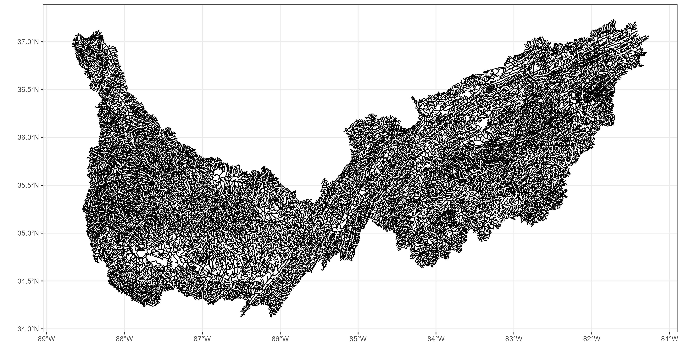
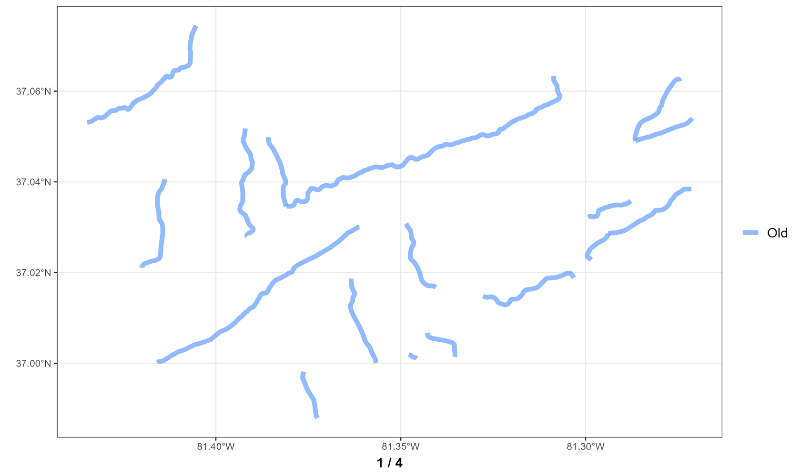

```{r setup, include=FALSE}
library(ggmapinset)
library(sf)
library(ggplot2)
library(dplyr)
library(sfheaders)
library(hydrofab)
library(arrow)

knitr::opts_chunk$set(echo = TRUE)
options(warn = -1, verbose = FALSE)

source("../workflow/nhdplusv2/utils.R")

# getting VAA from NHDPlus
vaa <- nhdplusTools::get_vaa()

# new attributes
new_atts = arrow::read_parquet("D:/reference_geometries/enhd_nhdplusatts.parquet")
# new_atts = read_parquet(glue("{base_dir}/enhd_nhdplusatts.parquet"))

# # read in fn_list object 
# fn_list <- readRDS("D:/nhd_ref_features_backup/misc/fn_list.rds")
# 
# # read in new geom object
# new_geom <- readRDS("D:/nhd_ref_features_backup/misc/new_geom.rds")

# Get the current flowline path
fl_path <- "D:/reference_geometries/02_Flowlines/NHDPlus06.gpkg"

# Burn Line Events geopackage path
ble_path <- "D:/reference_geometries/ble_events.gpkg"
# ble_path <- "D:/nhdplusv2_reference_features/02_BLE/NHDPlus06.gpkg"


# Get the VPU identifier for the current flowline file
# which_VPU = gsub(".gpkg", "", gsub("NHDPlus", "", basename(fl_path)))

# # Get the BLE path for the current VPU
# ble_path  = ble_paths[grep(which_VPU, basename(ble_paths))]
# 
# # Define the output file path for the processed flowlines
# outfile   = glue("{reference_dir}flowlines_{which_VPU}.gpkg")

# inset map point
lng = c(-81.30865)
lat = c(37.06332)

pt <-   data.frame(lng = lng, 
                   lat = lat
                   ) %>% 
  sf::st_as_sf( coords = c("lng", "lat"), crs = 4326) %>% 
  sf::st_geometry() %>% 
  sf::st_centroid()

aoi <-
  data.frame(lng = -81.30865, lat =  37.06332) %>%
  st_as_sf(coords = c("lng", "lat"), crs = 4269) %>%
  sf::st_transform(5070) %>%
  sf::st_buffer(11000) %>%
  sf::st_transform(4269)

# # ggplot theme 
# thm <- 
#   ggplot2::theme_bw() +
#   ggplot2::theme(
#     plot.title = ggplot2::element_text(size = 16, face = "bold", hjust = 0.5),
#     plot.subtitle =  ggplot2::element_text(size = 14, hjust = 0.5)
#   )

# ggplot theme 
thm <- 
  ggplot2::theme_bw() +
  ggplot2::theme(
    plot.title = ggplot2::element_text(size = 16, face = "bold", hjust = 0.5),
    plot.subtitle =  ggplot2::element_text(size = 14, hjust = 0.5),
    legend.text = ggplot2::element_text(size = 12),
    legend.title = ggplot2::element_text(face = "bold", size = 12),
    plot.caption = ggplot2::element_text(size = 12, face="bold", hjust = 0.5),
    legend.background = ggplot2::element_rect(fill="transparent", size=.5, linetype="dotted"),
    legend.spacing.y = unit(0.3, 'cm')
  )

  # ggplot2::guides(fill = ggplot2::guide_legend(byrow = TRUE))

source_cols = c(
  # "NHD" = "#00BA38",            # green
  "NHD" = "#619CFF",              # blue
    "Difference" = "#00BA38",
  "Burn Line Events" = "#F8766D",  # red
  "Removed" = "transparent"
  # "19485570" = "#619CFF"
  )

# 00cc33
# pos_cols <- c(
#   # "NHD" = "#00BA38",            # green
#   "Original" = "#619CFF",              # blue
#   "Updated" = "#F8766D"  # red
#   # "19485570" = "#619CFF"
#   )

group_colors <- c(
  "19485688" = "#00BA38",
  "19485662" = "#F8766D",
  "19485570" = "#619CFF"
  )

par = 6
```

The goal of this step in generating a new and improved NHDPlus dataset is to rectify missing attributes in NHDPlus flowlines and resolve network connectivity issues. 

To show what we did, we will walk through an example of our process on VPU 6. 

<br>
<br>

# 1. Read in NHDPlus flowlines

We first read in our original NHDPlus flowlines dataset, drop any Z/M dimensions, and align our columns with the NHDPlus names.

```{r, eval = T, echo = T}
# read in flowlines
nhd <- sf::read_sf(fl_path)

# remove Z/M dimensions and align names
nhd <- 
  nhd %>% 
  sf::st_zm() %>%
  nhdplusTools::align_nhdplus_names()
```

```{r, eval = FALSE, echo = FALSE}
# create nhd flowlines plot
nhd_plot <- rmapshaper::ms_simplify(nhd, keep = 0.005)

nhd_plot <-
  nhd_plot %>% 
  ggplot2::ggplot() +
  ggplot2::geom_sf() +
  thm 

ggplot2::ggsave(
  nhd_plot,
  filename = "../man/figures/nhd_flowlines_plot.png",
  height = 6,
  width = 12,
  scale = 1
)
rm(nhd_plot)
```

<center>

</center>

<br>
<br>
<br>

# 2. Join with VAA and E2NHD 

We have 2 sets of attribute data that we want to join and with `nhd`:

1. Value Added Attribute set (`vaa`). 
2. Updated network attributes from E2NHD https://doi.org/10.5066/P9W79I7Q (`new_atts`)

Here is a list of the attributes in the the Value Added Attributes dataset (`vaa`)
```{r, eval = TRUE, echo = TRUE}
# getting VAA from NHDPlus
vaa <- nhdplusTools::get_vaa()

names(vaa)
```

<br>
<br>


And these are the attributes in the E2NHD (`new_atts`)
```{r, eval = TRUE, echo = TRUE}
# new attributes
new_atts <- arrow::read_parquet("D:/reference_geometries/enhd_nhdplusatts.parquet")

names(new_atts)
```

<br>
<br>

To attach network connectivity information (i.e. from/to nodes, start flag, stream calc #) to each of the flowlines in the NHDPlus (`nhd`), we need to join the Value Added Attributes dataset (`vaa`) with the NHDPlus dataset (`nhd`).

```{r, eval = TRUE, echo = T}
nhd <-
  nhd %>% 
  dplyr::left_join(
    vaa, 
    by = c("COMID" = "comid")
    ) %>%
  dplyr::select(COMID, fromnode, tonode, startflag, streamcalc, divergence, dnminorhyd)
```

<br>
<br>

We then join the `nhd` dataset with the E2NHD (`new_atts`) dataset as the E2NHD dataset contains new, updated network connectivity information. 
For more information visit https://doi.org/10.5066/P9W79I7Q. 

Once we joined the E2NHD network attributes to our `nhd` data, we realign the names to match the NHDPlus names, and recalculate the flowline lengths. 

```{r, eval = TRUE, echo = T}
nhd <-
  nhd %>% 
  dplyr::left_join(
    new_atts,
    by = c("COMID" = "comid")
    ) %>%
  nhdplusTools::align_nhdplus_names() %>%
  dplyr::mutate(LENGTHKM  = add_lengthkm(.))

nhd
```


Now we have a NHDPlus flowlines dataset with the necessary and updated network attributes.

<br>
<br>
<br>

# 3. Burn Lines

Next thing to do is get our Burn lines data (`ble`), and filter the `ble` (burn line events) data to include only the rows with matching COMID values in the `nhd` dataset.

```{r, eval = TRUE, echo = T}
# Read the BLE file and perform some preprocessing steps
ble <- sf::read_sf(ble_path) 

# Filter the b burn line events dataset on matching COMIDs in 'nhd'
ble <- dplyr::filter(ble, COMID %in% nhd$COMID)

# We then create a `flag` for non empty geometries, where the `nhd` data 
# has a `startFlag` equal to 1 or a `Divergence` equal to 2. This flag indicates where to use the burn line geometries.
# We then replace any geometries in `nhd` with the burn line multilinestrings that were flagged as non empty start flags or divergences.  
ble
```

```{r, eval = FALSE, echo = FALSE}
# create burn line events plo
ble_plot <- 
  ble %>% 
  rmapshaper::ms_simplify(keep = 0.01) %>% 
  ggplot2::ggplot() +
  ggplot2::geom_sf() +
  thm

ggplot2::ggsave(
  ble_plot,
  filename = "../man/figures/ble_plot.png",
  height = 6,
  width = 12,
  scale = 1
)
```

<center>

</center>

<br>
<br>
<br>

# 4. Match and replace `nhd` with burn line events
Here we find indices in the filtered `ble` dataset that match with COMIDs in the `nhd` dataset, and store this as a variable (`matcher`)

<br>

```{r, eval = TRUE, echo = TRUE}
# Find the matching indices of COMIDs between 'ble' and 'nhd'
matcher = match(ble$COMID, nhd$COMID)

# number of matching indices
length(matcher)
```

```{r, eval = FALSE, echo = FALSE}
# goi <- "1285672"

 # tmp_buff <- 
 #  dplyr::filter(nhd[matcher, ], COMID == "19754399") %>% 
 #  sf::st_transform(5070) %>% 
 #  sf::st_buffer(4000) %>% 
 #  sf::st_transform(4269)

tmp_buff <-
  data.frame(lng = -81.30865, lat =  37.06332) %>%
  st_as_sf(coords = c("lng", "lat"), crs = 4269) %>%
  sf::st_transform(5070) %>%
  sf::st_buffer(10000) %>%
  sf::st_transform(4269)
# nhd[matcher, ] %>% 
#   sf::st_filter(nhd[matcher, ], tmp_buff)
#   sf::st_filter(ble, tmp_buff)
nhd_ble <- 
  dplyr::bind_rows(
    dplyr::mutate(
      # dplyr::filter(nhd[matcher, ], COMID == "19754399"),
        sf::st_filter(nhd[matcher, ], tmp_buff),
      source = "NHD"
      ),
    dplyr::mutate(
      # dplyr::filter(ble, COMID == "19754399"),
        sf::st_filter(ble, tmp_buff),
      source = "Burn Line Events"
      ) 
    ) %>% 
  # dplyr::mutate(source)
  dplyr::select(source, COMID, FromNode, ToNode, toCOMID, StartFlag, geom) %>% 
  dplyr::mutate(
    source = factor(source, levels = c("NHD", "Difference", "Burn Line Events"))
  )

ble_gif_plot1 <- 
  nhd_ble %>%
  dplyr::filter(source == "NHD") %>%
  ggplot2::ggplot() +
  ggplot2::geom_sf(ggplot2::aes(fill = source, color = source), lwd = 2) +
  # ggplot2::facet_wrap(~source) + 
  ggplot2::scale_fill_manual(values=source_cols) +
  ggplot2::scale_color_manual(values=source_cols) +
  ggplot2::labs(
    fill = "",
    color = "",
    caption = "1 / 3"
  ) + 
  thm + 
  # ggplot2::guides(fill = ggplot2::guide_legend(byrow = TRUE)) +
  ggplot2::theme(
    legend.position = "bottom",
    legend.text = ggplot2::element_text(size = 12),
    legend.spacing.x = unit(0.5, 'cm')
    ) +
  ggplot2::coord_sf()

ble_gif_plot2 <-
  nhd_ble %>%
  # dplyr::filter(source == "Burn Line Events") %>%
  ggplot2::ggplot() +
  ggplot2::geom_sf(ggplot2::aes(fill = source, color = source), lwd = 2) +
  # ggplot2::facet_wrap(~source) + 
  ggplot2::scale_fill_manual(values=source_cols) +
  ggplot2::scale_color_manual(values=source_cols) +
  ggplot2::labs(
    fill = "",
    color = "",
    caption = "2 / 3"
  ) + 
  thm + 
  # ggplot2::guides(fill = ggplot2::guide_legend(byrow = TRUE)) +
  ggplot2::theme(
    legend.position = "bottom",
    legend.text = ggplot2::element_text(size = 12),
    legend.spacing.x = unit(0.5, 'cm')
    ) +
  ggplot2::coord_sf()
  # dplyr::filter(nhd_ble, source == "Burn Line Events") %>% 

# ble_gif_plot3 <-
#   nhd_ble %>%
#   # dplyr::filter(source == "Burn Line Events") %>%
#   ggplot2::ggplot() +
#   ggplot2::geom_sf(ggplot2::aes(fill = source, color = source), lwd = 2) +
#   ggplot2::geom_sf(data = sf::st_transform(
#                               sf::st_buffer(
#                               sf::st_transform(
#                                 nhdplusTools::get_node(dplyr::filter(nhd_ble, source == "NHD"), position = "start"), 5070),
#                               150
#                               ), 4269
#                           ),
#                    fill = "transparent"
#                    ) +
#   # ggplot2::facet_wrap(~source) +
#   ggplot2::scale_fill_manual(values=source_cols) +
#   ggplot2::scale_color_manual(values=source_cols) +
#   ggplot2::labs(
#     fill = "",
#     color = ""
#   ) +
#   thm +
#   # ggplot2::guides(fill = ggplot2::guide_legend(byrow = TRUE)) +
#   ggplot2::theme(
#     legend.position = "bottom",
#     legend.text = ggplot2::element_text(size = 12),
#     legend.spacing.x = unit(0.5, 'cm')
#     ) +
#   ggplot2::coord_sf()
# ble_gif_plot3 <-
#     nhd_ble %>%
#   dplyr::mutate(
#     source = dplyr::case_when(
#       source == "NHD" ~ "Difference",
#       TRUE            ~ source
#     )
#   ) %>% 
#     ggplot2::ggplot() +
#     ggplot2::geom_sf(ggplot2::aes(fill = source, color = source), lwd = 2) +
#       # gghighlight::gghighlight(source %in% c("Difference")) +
#   # ggplot2::facet_wrap(~source) +
#   ggplot2::scale_fill_manual(values=source_cols) +
#   ggplot2::scale_color_manual(values=source_cols) +
#   ggplot2::labs(
#     fill = "",
#     color = "",
#     caption = "3 / 3"
#   ) +
#   thm +
#   # ggplot2::guides(fill = ggplot2::guide_legend(byrow = TRUE)) +
#   ggplot2::theme(
#     legend.position = "bottom",
#     legend.text = ggplot2::element_text(size = 12),
#     legend.spacing.x = unit(0.5, 'cm')
#     ) +
#   ggplot2::coord_sf()

update_cols = c(
  # "NHD" = "#00BA38",            # green
  "Old NHD" = "#808080",              # blue
  "New NHD" = "#619CFF"             # blue

  )

ble_gif_plot3 <-
  nhd_ble %>%
  dplyr::mutate(
    source = dplyr::case_when(
      source == "NHD" ~ "Old NHD",
      TRUE            ~ "New NHD"
    ),
    alpha = ifelse(source == "Old NHD", 1, 1),
        linewidth = ifelse(source == "Old NHD", 1, 2)
  ) %>% 
    ggplot2::ggplot() +
    ggplot2::geom_sf(ggplot2::aes(fill = source, color = source, alpha = source, group = source), lwd = 2) +
    ggplot2::scale_alpha_manual(values = c("New NHD" = 1, "Old NHD" = 0.5), guide = FALSE) +
  # ggplot2::scale_alpha_discrete(range = c("New NHD" = 0.35, "Old NHD" = 0.9)) +
      # gghighlight::gghighlight(source %in% c("Difference")) +
  # ggplot2::facet_wrap(~source) +
  ggplot2::scale_fill_manual(values=update_cols) +
  ggplot2::scale_color_manual(values=update_cols) +
    # ggplot2::scale_size_manual( values = c(3, 1) ) +
  # ggplot2::scale_linewidth_manual(values = c(3, 1) )+
 # ggplot2::scale_alpha_continuous(guide=FALSE) +
  ggplot2::labs(
    fill = "",
    color = "",
    caption = "3 / 3"
  ) +
  thm +
  # ggplot2::guides(fill = ggplot2::guide_legend(byrow = TRUE)) +
  ggplot2::theme(
    legend.position = "bottom",
    legend.text = ggplot2::element_text(size = 12),
    legend.spacing.x = unit(0.5, 'cm')
    ) +
  ggplot2::coord_sf()
    

ggplot2::ggsave(
  ble_gif_plot1,
  filename = "../man/figures/01_ble_diff_gif_plot.png",
  height = 6,
  width = 12,
  scale = 1
)
ggplot2::ggsave(
  ble_gif_plot2,
  filename = "../man/figures/02_ble_diff_gif_plot.png",
  height = 6,
  width = 12,
  scale = 1
)

# ggplot2::ggsave(
#   ble_gif_plot3,
#   filename = "../man/figures/03_ble_diff_gif_plot.png",
#   height = 6,
#   width = 12,
#   scale = 1
# )

ggplot2::ggsave(
  ble_gif_plot3,
  filename = "../man/figures/03_ble_diff_gif_plot.png",
  height = 6,
  width = 12,
  scale = 1
)

# # RUN TO MAKE BLE AND NHD DIFFERENCE GIF using plots made above
# # library(gifski)
png_files <- list.files("../man/figures/", pattern = "_ble_diff_gif_plot.png", full.names = TRUE)
gifski::gifski(png_files, gif_file = "../man/figures/ble_and_nhd_diff.gif", width = 2000, height = 1000, delay = 1.75)
```

```{r, eval = FALSE, echo = FALSE}
# goi <- "1285672"
nhd_ble <- 
  dplyr::bind_rows(
    dplyr::mutate(
      dplyr::filter(nhd[matcher, ], COMID == "19754399"),
      source = "NHD"
      ),
    dplyr::mutate(
      dplyr::filter(ble, COMID == "19754399"),
      source = "Burn Line Events"
      ) 
    ) %>% 
  # dplyr::mutate(source)
  dplyr::select(source, COMID, FromNode, ToNode, toCOMID, StartFlag, geom)


nhd_ble_plot <- 
  nhd_ble %>%
  # dplyr::filter(source == "NHD") %>% 
  ggplot2::ggplot() +
  ggplot2::geom_sf(ggplot2::aes(fill = source, color = source), lwd = 2) +
  # ggplot2::facet_wrap(~source) + 
  ggplot2::scale_fill_manual(values=source_cols) +
  ggplot2::scale_color_manual(values=source_cols) +
  ggplot2::labs(
    fill = "",
    color = ""
  ) + 
  thm + 
  ggplot2::theme(
    legend.position = "bottom",
    legend.text = ggplot2::element_text(size = 12), 
    legend.spacing.x = unit(0.5, 'cm')
    ) +
  ggplot2::coord_sf()
  
  
nhd_fline_plot <- 
  nhd_ble %>%
  dplyr::filter(source == "NHD") %>%
  ggplot2::ggplot() +
  ggplot2::geom_sf(data =   dplyr::filter(nhd_ble, source == "NHD"), 
                   ggplot2::aes(fill = source, color = source), lwd = 2) +
  # ggplot2::facet_wrap(~source) + 
  ggplot2::scale_fill_manual(values=source_cols) +
  ggplot2::scale_color_manual(values=source_cols) +
  ggplot2::labs(
    fill = "",
    color = ""
  ) + 
  thm +
  ggplot2::theme(
    legend.position = "bottom",
    legend.text = ggplot2::element_text(size = 12), 
    legend.spacing.x = unit(0.5, 'cm')
    )+
  ggplot2::coord_sf()

ble_fline_plot <-  
  nhd_ble %>%
  dplyr::filter(source == "Burn Line Events") %>%
  ggplot2::ggplot() +
  ggplot2::geom_sf(ggplot2::aes(fill = source, color = source), lwd = 2) +
  # ggplot2::facet_wrap(~source) + 
  ggplot2::scale_fill_manual(values=source_cols) +
  ggplot2::scale_color_manual(values=source_cols) +
  ggplot2::labs(
    fill = "",
    color = ""
  ) + 
  thm +
  ggplot2::theme(
    legend.position = "bottom",
    legend.text = ggplot2::element_text(size = 12), 
    legend.spacing.x = unit(0.5, 'cm')
    )+
  ggplot2::coord_sf()

# library(patchwork)
side_by_side_plot <- (nhd_fline_plot + ggplot2::theme(legend.position = "bottom")) + 
  (ble_fline_plot + ggplot2::theme(legend.position = "bottom"))

  
# final_ble_plot <- 
#   nhd_ble %>%
#   dplyr::filter(source == "Burn Line Events") %>%
#   dplyr::mutate(
#     source = dplyr::case_when(
#       source == "Burn Line Events" ~ "NHD",
#       TRUE                         ~ source
#     )
#   ) %>% 
#   ggplot2::ggplot() +
#   ggplot2::geom_sf(ggplot2::aes(fill = source, color = source), lwd = 2) +
#   # ggplot2::facet_wrap(~source) + 
#   ggplot2::scale_fill_manual(values=source_cols) +
#   ggplot2::scale_color_manual(values=source_cols) +
#   ggplot2::labs(
#     fill = "",
#     color = ""
#   ) + 
#   thm + 
#   ggplot2::theme(
#     # legend.position = "bottom",
#     legend.text = ggplot2::element_text(size = 12), 
#     legend.spacing.y = unit(0.3, 'cm')
#     ) +
#    ggplot2::coord_sf()


# ggplot2::ggsave(
#   nhd_fline_plot,
#   filename = "../man/figures/01_ble_gif_plot.png",
#   height = 6,
#   width = 12,
#   scale = 1
# )
# ggplot2::ggsave(
#   ble_fline_plot,
#   filename = "../man/figures/02_ble_gif_plot.png",
#   height = 6,
#   width = 12,
#   scale = 1
# )
# 
# ggplot2::ggsave(
#   nhd_ble_plot,
#   filename = "../man/figures/03_ble_gif_plot.png",
#   height = 6,
#   width = 12,
#   scale = 1
# )

ggplot2::ggsave(
  nhd_ble_plot,
  filename = "../man/figures/nhd_ble_fline_replace.png",
  height = 6,
  width = 12,
  scale = 1
)
# 
# ggplot2::ggsave(
#   nhd_fline_plot,
#   filename = "../man/figures/nhd_fline_before_ble_replace.png",
#   height = 6,
#   width = 12,
#   scale = 1
# )
# ggplot2::ggsave(
#   ble_fline_plot,
#   filename = "../man/figures/ble_fline_before_ble_replace.png",
#   height = 6,
#   width = 12,
#   scale = 1
# )

ggplot2::ggsave(
  side_by_side_plot,
  filename = "../man/figures/nhd_ble_fline_side_by_side.png",
  height = 6,
  width = 12,
  scale = 1
)

# # library(gifski)
# png_files <- list.files("../man/figures/", pattern = "_ble_gif_plot.png", full.names = TRUE)
# gifski::gifski(png_files, gif_file = "../man/figures/replacing_nhd_with_ble.gif", width = 1900, height = 900, delay = 1.5)
```

<center>

</center>

<br>
<br>

We then replace the geometries in the `nhd` dataset with the `ble` geometries at the matching indices obtained in the previous step. This operation *changes* the `nhd` geometries— COMIDs in NHD that match burn line COMIDs are replaced by the `ble` geometries.

<br>

```{r, eval = TRUE, echo = TRUE}
# Replace the geometry in nhd geometry with ble geometries at the matching indices
sf::st_geometry(nhd)[matcher] <- sf::st_geometry(ble)
```

<center>

</center>

<br>
<br>
<br>

# 5. Create a custom network
Using our `nhd` data, we use our `FromNode` and `ToNode` for each COMID to get a corrected `tocomid` that we will use to override the current `nhd` `toCOMID` data.

<br>

Using `nhdplusTools::get_tocomid()` generates a corrected `tocomid` value for each COMID in the `nhd` data based on the `tonode` and `fromnode` attributes, taking into account any specified divergence and `terminalpa` attributes. This corrected `tocomid` value is used to update the `override_tocomid` column in the `nhd` data, **improving the network connectivity of the flowlines.**

<br>

```{r, eval = TRUE, echo = TRUE}
# Generate a custom network for the flowlines based on the override_tocomid values
custom_net <- 
  nhd %>%
  sf::st_drop_geometry() %>%
  dplyr::select(COMID, FromNode, ToNode, Divergence) %>%
  nhdplusTools::get_tocomid(remove_coastal = FALSE) %>%
  dplyr::select(comid, override_tocomid = tocomid)
```

<br>

We then join this `custom_net` with our `nhd` data by COMID to add the `override_tocomid` column to our original data. We then update the `override_tocomid` data by setting the value to the `override_tocomid` from the `custom_net` if the `toCOMID` value equals 0, otherwise we just keep the original `toCOMID` COMID value.


The next section of the code performs a left join operation between the `nhd` dataset and the `custom_net` dataset based on matching COMIDs.
It updates the `override_tocomid` column in `nhd` with values from the `toCOMID` column, but only if the value in `toCOMID` is *not* equal to 0. 
If `toCOMID` *is* 0, it keeps the original value from `override_tocomid.` The resulting updated `nhd` dataset is assigned back to the `nhd` variable.

<br>

```{r, eval = TRUE, echo = TRUE}
# # Update the override_tocomid values to account for nodes with no downstream flow
nhd <-
  dplyr::left_join(
    nhd,
    custom_net,
    by = c("COMID" = "comid")
  ) %>%
  dplyr::mutate(
    override_tocomid = ifelse(toCOMID == 0, override_tocomid, toCOMID)
  ) 
```

<br>
<br>
<br>

# 6. Check for headwaters

We create a logical vector to check where the `COMID` in `nhd` is **NOT** present in the `override_tocomid` column, which indicates a **headwater** segment that should flow into another segment.

The condition **`!(nhd$override_tocomid == 0 | is.na(nhd$override_tocomid) | !nhd$override_tocomid %in% nhd$COMID)`** checks that the `override_tocomid` is not 0, not NA, and is present in the `nhd$COMID` column.

<br>

The conditions we make our check by are as follows: 

1. **`nhd$override_tocomid == 0`**: This checks if the override_tocomid value is equal to 0. In the context of river directionality, a value of 0 would typically indicate that the segment is a headwater or does not have a downstream connection.

2. **`is.na(nhd$override_tocomid)`**: This checks if the `override_tocomid` value is NA (missing). Missing indicate incomplete or unknown downstream connections. 

3. **`!nhd$override_tocomid %in% nhd$COMID`**: This checks if the `override_tocomid` value is not present in the nhd$COMID column. In the context of river directionality, this condition ensures that the downstream segment referred to by `override_tocomid` actually *exists* in the dataset. 
If it is **NOT** present, this could mean an error has come up.

<br>
<br>

```{r, eval = TRUE, echo = TRUE}
# # Check for any invalid override_tocomid values, that each flowline is a headwater and leads somewhere
check <- !nhd$COMID %in% nhd$override_tocomid &
  !(nhd$override_tocomid == 0 | is.na(nhd$override_tocomid) |
      !nhd$override_tocomid %in% nhd$COMID)

table(check)
```

<br>

In this example, we have **34,771 FALSE** and **24,586 TRUE** values. 

We then filter `nhd` based on the logical vector `check`, and create a new `check_direction` dataset, that includes ***only*** the records satisfying the check condition, which are that there is a non 0, non NA, and present `override_tocomid` in the `nhd$COMID` column.

We have 24,586 TRUE values and thus we filter `nhd` down to 24,586 flowlines.

<br>

```{r, eval = TRUE, echo = TRUE}
# Filter the flowlines to only those with
check_direction <- dplyr::filter(nhd, check)
```

<br>

Then we find matching indices of `override_tocomid` in `nhd` and `check_direction`, and then get the corresponding rows from `nhd`.

```{r, eval = TRUE, echo = TRUE}
# Find matching indices of override_tocomid in nhd and check_direction
matcher <- match(check_direction$override_tocomid, nhd$COMID)
```

Once the matching indices  of `override_tocomid` in `nhd` and `check_direction` are found, the next step gets the corresponding rows from the `nhd` dataset and assigns them to the variable `matcher`.

<br>

This step is crucial for preparing the data for the **`nhdplusTools`** function `fix_flowdir()`.
```{r, eval = TRUE, echo = TRUE}
# Get the matched rows from nhd
matcher <- nhd[matcher, ]
```

<br>
<br>
<br>

# 7. Prepare data for fixing flow directions 

We split `check_direction` and `matcher` into individual elements and pair each cooresponding element into a single list (`fn_list`), which we will use to fix the flowline direction issues.

<br>

```{r, eval = TRUE, echo = TRUE}
# Create a list combining check_direction and matcher
fn_list <- Map(
  list,
  split(check_direction, seq_len(nrow(check_direction))),
  split(matcher, seq_len(nrow(matcher)))
  )
```

<br>
<br>
<br>

# 8. Fix flow directions

Next, we create a cluster of parallel workers using the `makeCluster()` fix our flow directions using parallel processing.

`pblapply()` is used to apply the `fix_flowdir()` function from **`nhdplusTools`** in parallel to each element of `fn_list.` 

**By applying fix_flowdir() we are able to fix the flow directionality of the flowlines.**

<br>

```{r, eval = TRUE, echo = TRUE}
# make cluster of parallel workers
cl <- parallel::makeCluster(par)

# check and fix these
# parallel applies fix_flowdir() in parallel to each element of fn_list 
new_geom <- pbapply::pblapply(
  cl  = cl,
  X   = fn_list,
  FUN = function(x) {
    nhdplusTools::fix_flowdir(x[[1]]$COMID,
                              fn_list = list(
                                flowline  = x[[1]],
                                network   = x[[2]],
                                check_end = "end"
                              ))
  }
)

# stop parallel cluster     
parallel::stopCluster(cl)
```

<br>

### Error checking

We then create a logical vector `error_index` that identifies the geometries in the `new_geom` object that encountered errors when `fix_flowdir()` was applied to try and correct flowline directionality. We check the outputs from fix_flowdir() for any elements that returned a "try-error" value. 

(Create `errors` dataframe that contains the COMID rows in `nhd` for any COMIDs that produced errors) 

We create a new data frame (`errors`) that filters our `nhd` dataset by the COMIDs in `check_directions` that produced errors. It selects the rows where the COMID matches those with errors 

<br>

```{r, eval = TRUE, echo = TRUE}
 # check for errors based on try-error conditions
error_index <- sapply(new_geom, inherits, what = "try-error")

# identify the geometries that encountered errors during fix_flowdir() and store in "errors" df 
errors <- filter(nhd, COMID %in% check_direction$COMID[error_index])
```

<br>

In this case, we ran into 0 errors and thus our `errors` dataframe has 0 rows in it.

```{r, eval = TRUE, echo = TRUE}
nrow(errors)
```

<br>

Before we can replace our the `nhd` flowlines with the corrected flowlines in `new_geom`, we need to update our `check` variable by setting elements to FALSE wherever `nhd` COMIDs match the COMID values from the `errors` data frame.

Based on the errors produced by `fix_flowdir()`, we can mark the flowlines that do **NOT** meet the conditions for being a headwater as FALSE.

We do a check for any errors (other than empty geometry errors) in the `errors` dataframe. If an error other than an empty geometry error is found, an error is raised.

```{r, eval = TRUE, echo = TRUE}
# update check as needed
# marks the flowlines that do NOT meet the conditions for being a headwater, based on the errors that occurred.
check[which(nhd$COMID %in% errors$COMID)] <- FALSE

# Check for errors other than empty geometry errors
if(!all(sapply(st_geometry(errors), st_is_empty))) {
  stop("Errors other than empty geometry from fix flowdir")
}
```

<br>
<br>

Next, we update the `nhd` geometries by replacing the geometries with the corrected geometries from `new_geom`. 
Only the geometries in `nhd` that are marked as TRUE in `check` are replaced with the corrected geometries from `new_geom`, while the geometries at marked as FALSE remain unchanged. This way we ensure that only the geometries marked as headwaters are modified.

The replacement is determined by a condition defined by the `check` vector, which ensures that only the geometries marked as headwaters are modified.

<br>
```{r, eval = FALSE, echo = FALSE}
# mapview::mapview(orig_fline, color = "blue") + mapview::mapview(orig_end, col.regions = "blue") +
#   mapview::mapview(new_fline, color = "red") + mapview::mapview(new_end, col.regions = "red")

# mapview::mapview( nhd[check,][1, ], color = "blue") + mapview::mapview(nhd2[check,][1, ], color = "red")

nhd2 <- nhd

# Replace the geometry in 'nhd' with the corrected geometries
st_geometry(nhd2)[check] <- do.call(c, new_geom[!error_index])

pos_cols <- c(
  # "NHD" = "#00BA38",            # green
  "Old" = "#619CFF",              # blue
  "New" = "#F8766D"  # red
  # "19485570" = "#619CFF"
  )
# buff <- orig_end %>% 
#   sf::st_buffer(20000)
aoi <-
  data.frame(lng = -81.30865, lat =  37.06332) %>%
  st_as_sf(coords = c("lng", "lat"), crs = 4269) %>%
  sf::st_transform(5070) %>%
  sf::st_buffer(10000) %>%
  sf::st_transform(4269)

orig_fline <-
  nhd[check,] %>%
  sf::st_filter(aoi) %>%
  dplyr::mutate(  source = "Old")

new_fline <-  nhd2[check,] %>%
  sf::st_filter(aoi) %>%
  dplyr::mutate(source = "New" ) 
# 
flines <- dplyr::bind_rows(orig_fline, new_fline ) %>% 
  dplyr::mutate(
    source = factor(source, levels = c("Old", "New"))
  )
# 
end_pts <-  flines %>%
  nhdplusTools::get_node(position = "end") %>%
  dplyr::mutate(position = "end") 

end_pts$COMID <- flines$COMID
end_pts$source <- flines$source
end_pts <- dplyr::relocate(end_pts, COMID, position, source, geometry)

# # view updates on mapview()
# mapview::mapview(orig_fline, color = "cyan") +
#  mapview::mapview( end_pts[end_pts$source == "Old", ], col.regions = "cyan") +
#  mapview::mapview( end_pts[end_pts$source == "New", ], col.regions = "red")

orig_flines_plot <- 
  ggplot2::ggplot() +
    ggplot2::geom_sf(
      data = dplyr::filter(flines, source == "Old"),
      ggplot2::aes(fill = source, color = source),
      alpha=0.7,
      lwd = 2
      ) +
    # ggplot2::geom_sf(color = "red", lwd = 2) +
    ggplot2::scale_fill_manual(values=pos_cols) +
    ggplot2::scale_color_manual(values=pos_cols) +
    ggplot2::labs(
      # fill = "Source",
      # color = "Source"
      fill = "",
      color = "",
      caption = "1 / 4"
    ) +
    thm +
    ggplot2::theme(
      legend.text = ggplot2::element_text(size = 12), 
      legend.spacing.y = unit(0.3, 'cm')) +
    ggplot2::guides(fill = ggplot2::guide_legend(byrow = TRUE))
 
 # orig_flines_plot

orig_end_plot <- 
  ggplot2::ggplot() +
    ggplot2::geom_sf(
      data =    dplyr::filter(flines, source == "Old"), 
      ggplot2::aes(fill = source, color = source),
      alpha=0.7,
      lwd = 2
      ) +
    ggplot2::geom_sf(data = dplyr::filter(end_pts, source == "Old"),
                 ggplot2::aes(fill = source, color = source), 
                 size = 5
                 ) +
    ggplot2::scale_fill_manual(values=pos_cols) +
    ggplot2::scale_color_manual(values=pos_cols) +
    ggplot2::labs(
      # fill = "End points",
      # color = "End points"
      fill = "",
      color = "",
      caption = "2 / 4"
    ) +
    thm +
    ggplot2::theme(
      legend.text = ggplot2::element_text(size = 12), 
      legend.spacing.y = unit(0.3, 'cm')) +
    ggplot2::guides(fill = ggplot2::guide_legend(byrow = TRUE))

rev_dir_plot <- 
    ggplot2::ggplot() +
      ggplot2::geom_sf(
        data =    dplyr::filter(flines, source == "Old"), 
        ggplot2::aes(fill = source, color = source),
        alpha=0.7,
        lwd = 2) +
  
      ggplot2::geom_sf(data =    dplyr::filter(end_pts, source == "Old"),
                       ggplot2::aes(fill = source, color = source), 
                       size = 5
                       ) +
      ggplot2::geom_sf(data =    dplyr::filter(end_pts, source == "New"),
                       ggplot2::aes(fill = source, color = source), 
                       size = 5
                       ) +
    ggplot2::scale_fill_manual(values=pos_cols) +
    ggplot2::scale_color_manual(values=pos_cols) +
    ggplot2::labs(
      # fill = "End points",
      # color = "End points"
      fill = "",
      color = "",
      caption = "3 / 4"
    ) +
    thm +
    ggplot2::theme(
      legend.text = ggplot2::element_text(size = 12), 
      legend.spacing.y = unit(0.3, 'cm')) +
    ggplot2::guides(fill = ggplot2::guide_legend(byrow = TRUE))

orig_rm_plot <-
  ggplot2::ggplot() +
        ggplot2::geom_sf(
          data =    dplyr::filter(flines, source == "Old"), 
          ggplot2::aes(fill = source, color = source),
          alpha=0.7,
          lwd = 2) +
        ggplot2::geom_sf(data =    dplyr::filter(end_pts, source == "New"),
                         ggplot2::aes(fill = source, color = source), 
                         size = 5
                         ) +
    ggplot2::scale_fill_manual(values=pos_cols) +
    ggplot2::scale_color_manual(values=pos_cols) +
    ggplot2::labs(
      # fill = "End points",
      # color = "End points"
      fill = "",
      color = "",
      caption = "4 / 4"
    ) +
    thm +
    ggplot2::theme(
      legend.text = ggplot2::element_text(size = 12), 
      legend.spacing.y = unit(0.3, 'cm')) +
    ggplot2::guides(fill = ggplot2::guide_legend(byrow = TRUE))

# orig_flines_plot
# orig_end_plot
# rev_dir_plot
# orig_rm_plot
# orig_flines_plot
# 
ggplot2::ggsave( orig_flines_plot,
  filename = "../man/figures/01_flowdir_gif_plot.png",
  height = 6, width = 10, scale = 1)

ggplot2::ggsave(orig_end_plot,
  filename = "../man/figures/02_flowdir_gif_plot.png",
  height = 6, width = 10, scale = 1)

ggplot2::ggsave(rev_dir_plot,
  filename = "../man/figures/03_flowdir_gif_plot.png",
  height = 6,   width = 10,   scale = 1 )

ggplot2::ggsave( orig_rm_plot,
  filename = "../man/figures/04_flowdir_gif_plot.png",
  height = 6,width = 10,  scale = 1)

library(gifski)
png_files <- list.files("../man/figures/", pattern = "_flowdir_gif_plot.png", full.names = TRUE)
gifski::gifski(png_files, gif_file = "../man/figures/fixing_flowdirs.gif",  width = 1700, height = 1000,  delay = 1.75)

rm(nhd2)
```

```{r, eval = TRUE, echo = TRUE}
# Replace the geometry in 'nhd' with the corrected geometries
st_geometry(nhd)[check] <- do.call(c, new_geom[!error_index])
```

<center>

</center>


<br>

In the example above, we have headwater flowlines that originally have there end nodes at the **most upstream point** of the flowline, however, the ending node of any given flowline should represent the **most downstream point** of the given flowline.

Once we could identify the headwater flowlines with incorrect directionality, we could correct the flow direction using `fix_flowdir()`. 

<br>
<br>

```{r, eval = FALSE, echo = FALSE}
# library(nhdplusTools)
# library(elevatr)
# 
# elevatr::get_elev_point()
# 
# initial_end <- nhd[check,] %>% 
#   dplyr::filter(COMID == "19760938") %>% 
#   get_node(position = "end") %>% 
#   dplyr::mutate(
#     source = "initial")
# 
# update_end <- nhd2[check,] %>% 
#   dplyr::filter(COMID == "19760938") %>% 
#   get_node(position = "end") %>% 
#   dplyr::mutate(
#     source = "update")

# end_pts <- dplyr::bind_rows(
#   initial_end,
#   update_end
#   ) %>% 
#   dplyr::group_by(source) %>% 
#   dplyr::mutate(
#     x = sf::st_coordinates(geometry)[, 1],
#     y = sf::st_coordinates(geometry)[, 2]
#   ) %>% 
#   dplyr::select(x, y) %>% 
#   sf::st_drop_geometry()
# 
# elevatr::get_elev_point(end_pts, prj = 4269,  src =  "aws")

# tmp_nhd <- nhd2[check,] %>% 
#     dplyr::filter(COMID == "19760938") 
# mapview::mapview(initial_end, col.regions = "red") + mapview::mapview(update_end, col.regions = "blue") + tmp_nhd
```


