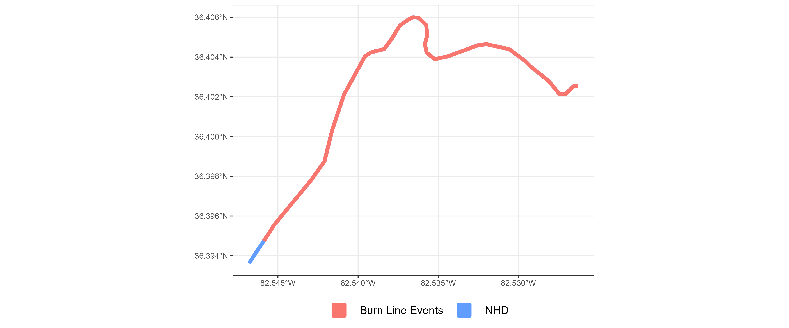

```{r setup, include=FALSE}
library(ggmapinset)
library(sf)
library(ggplot2)
library(dplyr)
library(sfheaders)
library(hydrofab)
library(arrow)

knitr::opts_chunk$set(echo = TRUE)
options(warn = -1, verbose = FALSE)

source("../workflow/nhdplusv2/utils.R")

# getting VAA from NHDPlus
vaa <- nhdplusTools::get_vaa()

# new attributes
new_atts = arrow::read_parquet("D:/reference_geometries/enhd_nhdplusatts.parquet")
# new_atts = read_parquet(glue("{base_dir}/enhd_nhdplusatts.parquet"))

# Get the current flowline path
fl_path <- "D:/reference_geometries/02_Flowlines/NHDPlus06.gpkg"

ble_path <- "D:/reference_geometries/ble_events.gpkg"
# ble_path <- "D:/nhdplusv2_reference_features/02_BLE/NHDPlus06.gpkg"


# Get the VPU identifier for the current flowline file
# which_VPU = gsub(".gpkg", "", gsub("NHDPlus", "", basename(fl_path)))

# # Get the BLE path for the current VPU
# ble_path  = ble_paths[grep(which_VPU, basename(ble_paths))]
# 
# # Define the output file path for the processed flowlines
# outfile   = glue("{reference_dir}flowlines_{which_VPU}.gpkg")

# inset map point
lng = c(-84.17691)
lat = c(35.15163)

pt <-   data.frame(lng = lng, 
                   lat = lat
                   ) %>% 
  sf::st_as_sf( coords = c("lng", "lat"), crs = 4326) %>% 
  sf::st_geometry() %>% 
  sf::st_centroid()

# ggplot theme 
thm <- 
  ggplot2::theme_bw() +
  ggplot2::theme(
    plot.title = ggplot2::element_text(size = 16, face = "bold", hjust = 0.5),
    plot.subtitle =  ggplot2::element_text(size = 14, hjust = 0.5)
  )

source_cols = c(
  # "NHD" = "#00BA38",            # green
  "NHD" = "#619CFF",              # blue
  "Burn Line Events" = "#F8766D"  # red
  # "19485570" = "#619CFF"
  )

group_colors <- c(
  "19485688" = "#00BA38",
  "19485662" = "#F8766D",
  "19485570" = "#619CFF"
  )
```

The goal of this step in generating a new and improved NHDPlus dataset is to rectify missing attributes in NHDPlus flowlines and resolve network connectivity issues. 

To show what we did, we will walk through an example of our process on VPU 6. 

<br>
<br>

# 1. Read in NHDPlus flowlines

We first read in our original NHDPlus flowlines dataset, drop any Z/M dimensions, and align our columns with the NHDPlus names.

```{r, eval = T, echo = T}
# read in flowlines
nhd <- sf::read_sf(fl_path)

# remove Z/M dimensions and align names
nhd <- 
  nhd %>% 
  sf::st_zm() %>%
  nhdplusTools::align_nhdplus_names()
```

<br>
<br>

# 2. Join with VAA and E2NHD 

We have 2 sets of attribute data that we want to join and with `nhd`:

1. Value Added Attribute set. 
2. Updated network attributes from E2NHD https://doi.org/10.5066/P9W79I7Q

Here is a list of the attributes in the the Value Added Attributes dataset
```{r, eval = FALSE, echo = TRUE}
# getting VAA from NHDPlus
vaa <- nhdplusTools::get_vaa()

names(vaa)
```

And these are the attributes in the E2NHD.
```{r, eval = FALSE, echo = TRUE}
# new attributes
new_atts <- arrow::read_parquet("D:/reference_geometries/enhd_nhdplusatts.parquet")

names(new_atts)
```

We first join `vaa` with `nhd` to attach network connectivity information to each of the flowlines COMIDs (i.e. from/to nodes, start flag, stream calc #)

```{r, eval = TRUE, echo = T}
nhd <-
  nhd %>% 
  dplyr::left_join(
    vaa, 
    by = c("COMID" = "comid")
    ) %>%
  dplyr::select(COMID, fromnode, tonode, startflag, streamcalc, divergence, dnminorhyd)
```

<br>

We then join the `nhd` dataset with the `new_atts` from E2NHD which contain improved network connectivity information. 

For more information visit https://doi.org/10.5066/P9W79I7Q. We also realign the names to match the NHDPlus names, and recalculate the flowline lengths. 

```{r, eval = TRUE, echo = T}
nhd <-
  nhd %>% 
  dplyr::left_join(
    new_atts,
    by = c("COMID" = "comid")
    ) %>%
  nhdplusTools::align_nhdplus_names() %>%
  dplyr::mutate(LENGTHKM  = add_lengthkm(.))
```

Now we have a NHDPlus flowlines with the necessary attributes.

<br>
<br>

# 3. Burn Lines

Next thing to do is get our Burn lines data (`ble`), and filter the `ble` (burn line events) data to include only the rows with matching COMID values in the `nhd` dataset.

```{r, eval = TRUE, echo = T}
# Read the BLE file and perform some preprocessing steps
ble <- sf::read_sf(ble_path) 

# Filter the b burn line events dataset on matching COMIDs in 'nhd'
ble <- dplyr::filter(ble, COMID %in% nhd$COMID)

# We then create a `flag` for non empty geometries, where the `nhd` data 
# has a `startFlag` equal to 1 or a `Divergence` equal to 2. This flag indicates where to use the burn line geometries.
# We then replace any geometries in `nhd` with the burn line multilinestrings that were flagged as non empty start flags or divergences.  
ble
```

```{r, eval = FALSE, echo = FALSE}
# create burn line events plo
ble_plot <- 
  ble %>% 
  rmapshaper::ms_simplify(keep = 0.01)
  ggplot2::ggplot() +
  ggplot2::geom_sf() +
  thm

ggplot2::ggsave(
  ble_plot,
  filename = "../man/figures/ble_plot.png",
  height = 5,
  width = 12,
  scale = 1
)
```

<center>

</center>

<br>
<br>

# 4. Matching `nhd` with burn line events
Finds the matching indices of `COMID` values between the filtered `ble` dataset and the `nhd` dataset, storing them in a variable (`matcher`)

<br>

```{r, eval = TRUE, echo = TRUE}

# inters <- nhd[match(ble$COMID, nhd$COMID),]$COMID[1:50]

# inters <- c(19763188,19761868,19760924,19760892,19762134,19762112,19762960,19762964,19762956,
#             19762858,19761522,19762106,19761452,19762890,19763186,19762824,19761964,19763204,19761174,
#             19761900,19762558,19762196,19761228,19761406,19762480,19761928,19761562,19762946,
#             19762936,19762930,19762934,19762926,19763230, 19762916, 19762860, 
#             19762888, 19762838, 19762806,19762822,19762840,19762796,19762864,
#             19762852,19762826,19763224, 19762784,19762628,19762672,19762722, 19762696)

# nhd2 <- dplyr::filter(nhd, COMID == "19754399")
# ble2 <- dplyr::filter(ble, COMID == "19754399")


# nhd2 <- dplyr::filter(nhd, COMID %in% inters)
# ble2 <- dplyr::filter(ble, COMID %in% inters)

# Find the matching indices of COMIDs between 'ble' and 'nhd'
matcher = match(ble$COMID, nhd$COMID)
# matcher = match(ble2$COMID, nhd2$COMID)
```

```{r, eval = FALSE, echo = FALSE}
# goi <- "1285672"
# nhd[matcher, ]
# nhd[matcher, ] %>% 
#   dplyr::filter(COMID == "19754399") %>% 
#   .$geom %>%
#   plot()
#   
# ble %>% 
#   dplyr::filter(ble, COMID == "19762544") %>% 
#   .$geom %>%
#   plot()

nhd_ble <- 
  dplyr::bind_rows(
    dplyr::mutate(
      dplyr::filter(nhd[matcher, ], COMID == "19754399"),
      source = "NHD"
      ),
    dplyr::mutate(
      dplyr::filter(ble, COMID == "19754399"),
      source = "Burn Line Events"
      ) 
    ) %>% 
  # dplyr::mutate(source)
  dplyr::select(source, COMID, FromNode, ToNode, toCOMID, StartFlag, geom)


nhd_ble_plot <- 
  nhd_ble %>%
  # dplyr::filter(source == "NHD") %>% 
  ggplot2::ggplot() +
  ggplot2::geom_sf(ggplot2::aes(fill = source, color = source), lwd = 2) +
  # ggplot2::facet_wrap(~source) + 
  ggplot2::scale_fill_manual(values=source_cols) +
  ggplot2::scale_color_manual(values=source_cols) +
  ggplot2::labs(
    fill = "",
    color = ""
  ) + 
  thm

nhd_fline_plot <- 
  nhd_ble %>%
  dplyr::filter(source == "NHD") %>%
  ggplot2::ggplot() +
  ggplot2::geom_sf(ggplot2::aes(fill = source, color = source), lwd = 2) +
  # ggplot2::facet_wrap(~source) + 
  ggplot2::scale_fill_manual(values=source_cols) +
  ggplot2::scale_color_manual(values=source_cols) +
  ggplot2::labs(
    fill = "",
    color = ""
  ) + 
  thm

ble_fline_plot <-  
  nhd_ble %>%
  dplyr::filter(source == "Burn Line Events") %>%
  ggplot2::ggplot() +
  ggplot2::geom_sf(ggplot2::aes(fill = source, color = source), lwd = 2) +
  # ggplot2::facet_wrap(~source) + 
  ggplot2::scale_fill_manual(values=source_cols) +
  ggplot2::scale_color_manual(values=source_cols) +
  ggplot2::labs(
    fill = "",
    color = ""
  ) + 
  thm

# library(patchwork)
side_by_side_plot <- (nhd_fline_plot + ggplot2::theme(legend.position = "bottom")) + (ble_fline_plot + ggplot2::theme(legend.position = "bottom"))

ggplot2::ggsave(
  nhd_ble_plot,
  filename = "../man/figures/nhd_ble_fline_replace.png",
  height = 5,
  width = 12,
  scale = 1
)

ggplot2::ggsave(
  nhd_fline_plot,
  filename = "../man/figures/nhd_fline_before_ble_replace.png",
  height = 5,
  width = 12,
  scale = 1
)
ggplot2::ggsave(
  ble_fline_plot,
  filename = "../man/figures/ble_fline_before_ble_replace.png",
  height = 5,
  width = 12,
  scale = 1
)

ggplot2::ggsave(
  side_by_side_plot,
  filename = "../man/figures/nhd_ble_fline_side_by_side.png",
  height = 5,
  width = 12,
  scale = 1
)
```

<center>

</center>


<br>
<br>

# 5. Replace `nhd` geometries with matching `ble`
Replaces the geometry in the `nhd` dataset with the `ble` geometries at the matching indices obtained in the previous step. This operation *changes* the `nhd` geometries, COMIDs in NHD that match burn line COMIDs are replaced by the `ble` geometries.

<br>

```{r, eval = TRUE, echo = TRUE}
# Replace the geometry in nhd geometry with ble geometries at the matching indices
sf::st_geometry(nhd)[matcher] <- sf::st_geometry(ble)
# sf::st_geometry(nhd2)[matcher] <- sf::st_geometry(ble2)
```

<center>

</center>

<br>
<br>

# 6. Create a custom network
Using our `nhd` data, we use our `FromNode` and `ToNode` for each COMID to get a corrected `tocomid` that we will use to override the current `nhd` `toCOMID` data.

<br>

Using `nhdplusTools::get_tocomid()` generates a corrected `tocomid` value for each COMID in the `nhd` data based on the `tonode` and `fromnode` attributes, taking into account any specified divergence and `terminalpa` attributes. This corrected `tocomid` value is used to update the `override_tocomid` column in the `nhd` data, **improving the network connectivity of the flowlines.**

<br>

```{r, eval = TRUE, echo = TRUE}
# Generate a custom network for the flowlines based on the override_tocomid values
custom_net <- 
  nhd %>%
  # nhd2 %>%
  sf::st_drop_geometry() %>%
  dplyr::select(COMID, FromNode, ToNode, Divergence) %>%
  nhdplusTools::get_tocomid(remove_coastal = FALSE) %>%
  dplyr::select(comid, override_tocomid = tocomid)
```

<br>

We then join this `custom_net` with our `nhd` data by COMID to add the `override_tocomid` column to our original data. We then update the `override_tocomid` data by setting the value to the `override_tocomid` from the `custom_net` if the `toCOMID` value equals 0, otherwise we just keep the original `toCOMID` COMID value.


The next section of the code performs a left join operation between the `nhd` dataset and the `custom_net` dataset based on matching COMIDs.
It updates the `override_tocomid` column in `nhd` with values from the `toCOMID` column, but only if the value in `toCOMID` is *not* equal to 0. 
If `toCOMID` *is* 0, it keeps the original value from `override_tocomid.` The resulting updated `nhd` dataset is assigned back to the `nhd` variable.

<br>

```{r, eval = TRUE, echo = TRUE}
# # Update the override_tocomid values to account for nodes with no downstream flow
nhd <-
  dplyr::left_join(
    nhd,
    custom_net,
    by = c("COMID" = "comid")
  ) %>%
  dplyr::mutate(
    override_tocomid = ifelse(toCOMID == 0, override_tocomid, toCOMID)
  ) %>% 
dplyr::relocate(COMID, FromNode, ToNode, toCOMID, override_tocomid, StartFlag, StreamCalc, Divergence) 
# nhd2 <- 
#   dplyr::left_join(
#     nhd2, 
#     custom_net, 
#     by = c("COMID" = "comid")
#   ) %>%
#   dplyr::relocate(COMID, FromNode, ToNode, toCOMID, override_tocomid, StartFlag, StreamCalc, Divergence) %>% 
#   dplyr::mutate(
#     override_tocomid = ifelse(toCOMID == 0, override_tocomid, toCOMID)
#   ) 
```


# 7. Check for headwaters

We create a logical vector to check where the `COMID` in `nhd` is **NOT** present in the `override_tocomid` column, which indicates a **headwater** segment that should flow into another segment.

The condition **`!(nhd$override_tocomid == 0 | is.na(nhd$override_tocomid) | !nhd$override_tocomid %in% nhd$COMID)`** checks that the `override_tocomid` is not 0, not NA, and is present in the nhd$COMID column.

<br>

The conditions we make our check by are as follows: 

1. **`nhd$override_tocomid == 0`**: This checks if the override_tocomid value is equal to 0. In the context of river directionality, a value of 0 would typically indicate that the segment is a headwater or does not have a downstream connection.

2. **`is.na(nhd$override_tocomid)`**: This checks if the `override_tocomid` value is NA (missing). Missing indicate incomplete or unknown downstream connections. 

3. **`!nhd$override_tocomid %in% nhd$COMID`**: This checks if the `override_tocomid` value is not present in the nhd$COMID column. In the context of river directionality, this condition ensures that the downstream segment referred to by `override_tocomid` actually *exists* in the dataset. 
If it is **NOT** present, this could mean an error has come up.

#### **^^^^^^^^^^^^^NOT SURE ABOUT num 2 ^^^^^^^^^^^^**

<br>

```{r, eval = TRUE, echo = TRUE}
# # Check for any invalid override_tocomid values, that each flowline is a headwater and leads somewhere
check <- !nhd$COMID %in% nhd$override_tocomid &
  !(nhd$override_tocomid == 0 | is.na(nhd$override_tocomid) |
      !nhd$override_tocomid %in% nhd$COMID)


# check <- !nhd2$COMID %in% nhd2$override_tocomid &
#   !(nhd2$override_tocomid == 0 | is.na(nhd2$override_tocomid) |
#       !nhd2$override_tocomid %in% nhd2$COMID)
```

```{r, eval = TRUE, echo = FALSE}
table(check)
```

<br>

In this example, we have 34771 FALSE and 24586 TRUE values. 

We then filter `nhd` based on the logical vector `check`, and create a new `check_direction` dataset, that includes *only* the records satisfying the check condition, which are that there is a non 0, non NA, and present `override_tocomid` in the `nhd$COMID` column. We have 24,586 TRUE values and thus we filter `nhd` down to 24,586 flowlines.

<br>

```{r, eval = TRUE, echo = TRUE}
# Filter the flowlines to only those with
check_direction <- dplyr::filter(nhd, check)
# check_direction2 <- dplyr::filter(nhd2, check)
```

<br>

Then we find matching indices of `override_tocomid` in `nhd` and `check_direction`, and then get the corresponding rows from `nhd`.

```{r, eval = TRUE, echo = TRUE}
# Find matching indices of override_tocomid in nhd and check_direction
matcher <- match(check_direction$override_tocomid, nhd$COMID)
```

Once the matching indices  of `override_tocomid` in `nhd` and `check_direction` are found, the next step gets the corresponding rows from the `nhd` dataset and assigns them to the variable `matcher`.

<br>

This step is crucial for preparing the data for the `nhdplusTools` function `fix_flowdir()`.
```{r, eval = TRUE, echo = TRUE}
# Get the matched rows from nhd
matcher <- nhd[matcher, ]
matcher
```

```{r, eval = FALSE, echo = FALSE}
dir_df <- dplyr::bind_rows(
  dplyr::mutate(
    matcher[1, ],
    # matcher,
    source = "matches"
  ),
    dplyr::mutate(
    check_direction[1, ],
      # check_direction,
    source = "check_dir"
    )
  ) %>% 
  dplyr::relocate(source, COMID, FromNode, ToNode, toCOMID, override_tocomid)

dir_df
mapview::mapview(dir_df[1, ], color = "blue") + mapview::mapview(dir_df[2, ], color = "red")
dir_df[1, ]$geom %>% plot()
dir_df[2, ]$geom %>% plot()

```


<br>
<br>

# 8. Prepare data for rectifiying flow directions 

The code creates a list called `fn_list` that combines `check_direction` and `matcher` by splitting them into individual elements and pairing them together.

<br>

```{r, eval = TRUE, echo = TRUE}

check_direction2 <- check_direction[1:50, ]
matcher2 <- matcher[1:50, ]

# Create a list combining check_direction and matcher
fn_list <- Map(
  list,
  split(check_direction2, seq_len(nrow(check_direction2))),
  split(matcher2, seq_len(nrow(matcher2)))
  )
# fn_list[1]
# # Create a list combining check_direction and matcher
# fn_list <- Map(list,
#                split(check_direction, seq_len(nrow(check_direction))),
#                split(matcher, seq_len(nrow(matcher))))
```

<br>
<br>

# 9. Rectify flow directions

Next, we create a cluster of parallel workers using the `makeCluster()` fix our flow directions using parallel processing.

`pblapply()` is used to apply the `fix_flowdir()` function from `nhdplusTools` in parallel to each element of `fn_list.` 

**This function fixes the flow directionality of the flowlines.**

<br>

```{r, eval = FALSE, echo = TRUE}
# make cluster of parallel workers
cl <- parallel::makeCluster(par)

# check and fix these
# parallel applies fix_flowdir() in parallel to each element of fn_list 
new_geom <- pbapply::pblapply(
  cl  = cl,
  X   = fn_list,
  FUN = function(x) {
    nhdplusTools::fix_flowdir(x[[1]]$COMID,
                              fn_list = list(
                                flowline  = x[[1]],
                                network   = x[[2]],
                                check_end = "end"
                              ))
  }
)

# stop parallel cluster     
parallel::stopCluster(cl)
```

<br>

```{r}
new_geom
```


<br>
<br>


